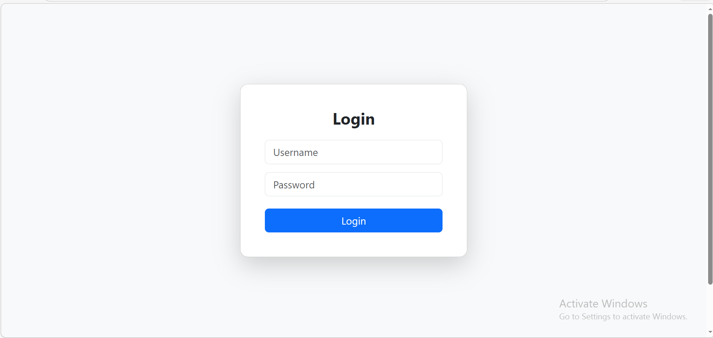
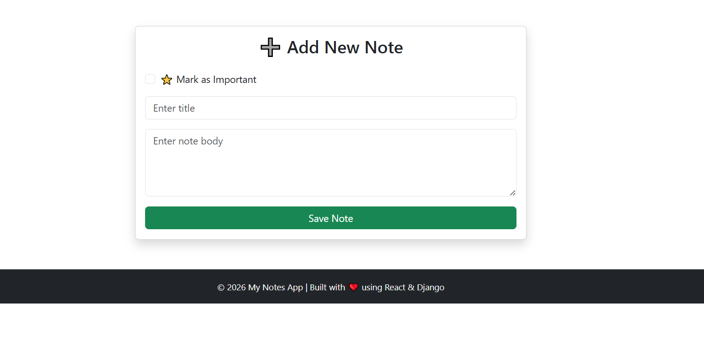

# 📝 Full Stack Notes App

A full stack Notes Application built using:

- 🔹 Django (Backend API)
- 🔹 Django REST Framework
- 🔹 React (Frontend)
- 🔹 JWT Authentication

---

## 🚀 Features

- User Registration & Login
- JWT Authentication
- Add Notes
- Edit Notes
- Delete Notes (with confirmation)
- Mark Notes as Important ⭐
- Filter Important Notes
- Search Notes
- Created At Timestamp

---

## 📸 Screenshots

### 🔐 Login Page


### 📄 Notes Dashboard


### ➕ Add Note


### ✏️ Edit Note


---

## ⚙️ Backend Setup (Django)

```bash
cd notesapi
python -m venv venv
venv\Scripts\activate
pip install -r requirements.txt
python manage.py migrate
python manage.py runserver
